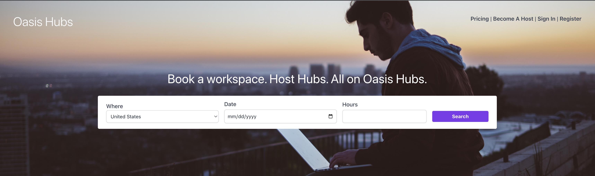

# Oasis Hubs - Stripe Connect and Metered Billing Demo



## Overview

The sample application contained in this repository aims to serve as a practical reference on how to
integrate Stripe Connect and metered billing into an ASP.NET Core application. It addresses core
concerns such as onboarding Express accounts, handling webhooks out of process, working with tiered
pricing,
subscriptions, invoices, test clocks and more.

The use case is centered around Oasis Hubs, a workspace booking platform focused on remote workers.
Customers are able to sign up for a monthly subscription that gives them access to book one of the
many unique
workspace listings. There are three subscription tiers available that offer different levels of
benefits and listing
access. The listings, also know as Hubs, are provided by hosts that get onboarded to Oasis and
associated with Stripe
Connect Express accounts.

## Requirements

* [.NET SDK 7.0+](https://get.dot.net)
* [Docker Desktop](https://www.docker.com/products/docker-desktop)
* [Stripe Account](https://dashboard.stripe.com/register)
* [Stripe CLI](https://stripe.com/docs/stripe-cli)

## [Container Dependencies](.compose/compose.yaml)

* [MS SQl Server](https://github.com/microsoft/mssql-docker/tree/master) - Relational storage for
  users, hubs, and bookings
* [Rabbitmq](https://github.com/docker-library/rabbitmq) - Message broker for handling webhook
  events
* [Redis](https://redis.io/docs/install/install-stack/docker/) - Distributed cache

## Running the demo
***This sample was meant to be run in TEST MODE!***

**Step 0**: <br /> 
Before running the demo, make sure you sign up for a Stripe
account, [activate it](https://dashboard.stripe.com/account/onboarding),
and go through the [Connect setup](https://dashboard.stripe.com/connect/tasklist) in the Stripe
Dashboard.

You will also need to active the [Customer Portal](https://dashboard.stripe.com/settings/billing/portal).


**Step 1**: <br />
Retrieve the Stripe API keys from the Developers area of the Dashboard and store them in
the `Stripe` section
of the [appsettings.Development.json](./src/OasisHubs.Site/appsettings.Development.json)
configuration file.

**Step 2**: <br />
Start up the container dependencies using the [compose.yaml](.compose/compose.yaml)
file.

**Step 3**: <br />
Run the application using the `dotnet run serve` command

**Step 4**: <br />
Forward Stripe event to the local server instance
```shell
stripe listen --forward-to http://localhost:5000/api/webhooks/stripe/platform --forward-connect-to  http://localhost:5000/api/webhooks/stripe/connect
```

**Step 5**: <br />
Navigate to http://localhost:5000 in your browser.git 

## Scenarios
### Connect Onboarding
* Sign in with a one of the **host** accounts listed below
* Navigate to the "Become a Host page"
* Complete the Stripe hosted onboarding
    *  The test values in the [Testing Stripe Connect](https://stripe.com/docs/connect/testing) are useful

### Start a subscription
* Sign in with a one of the **customer** accounts listed below
* Navigate to the "Pricing"
* Choose a subscription
* Complete the Stripe hosted checkout session
* From the homepage, navigate to the "Portal" page to manage the subscription

### Using Test Clocks
* Complete the "Start a subscription" scenario with a Test Clock enabled user
* Click the "Search" button on the homepage, choose a listing, and book it.
* From the [Stripe Dashboard](https://dashboard.stripe.com/), Navigate to the "Customers" section.
* Choose the matching customer the subscription was created for.
* Click on their subscription.
* Click on "Advance time", move the clock forward by a month or more
* Observe how the invoicing integration reacts.

## Useful Commands

Run container dependencies under the oasishubs project name

```shell
docker compose -f .compose/compose.yaml -p oasishubs up 
```

Provision the database and seed demo customers in Stripe

```shell
dotnet run data seed
```

Drop the demo database. <mark>This does not purge records in the associated Stripe account </mark>

```shell
dotnet run data drop
```

Run the application

```shell
dotnet run serve
```

Run the application with hot reload

```shell
dotnet watch -- run serve
```

Forward Stripe events to the local server

```shell
stripe listen --forward-to http://localhost:5000/api/webhooks/stripe/platform --forward-connect-to  http://localhost:5000/api/webhooks/stripe/connect
```

## Demo Users

| Name                 | Email            | Password | Type     | Test Clock |
|----------------------|------------------|----------|----------|------------|
| Cecil Phillip        | cecil@test.com   | Test     | Host     | No         |
| Phil Host            | phil@test.com    | Test     | Host     | No         |
| Jonathan Smith       | jon@test.com     | Test     | Customer | No         |
| Jaime Renter         | jaime@test.com   | Test     | Customer | No         |
| Benjamin Westminster | ben@test.com     | Test     | Customer | Yes        |
| Chronos Titan        | chronos@test.com | Test     | Customer | Yes        |

## Resources
* [Stripe Connect](https://stripe.com/docs/connect)
* [Stripe Connect Guide](https://stripe.com/docs/connect/explore-connect-guide)
* [Stripe Connect Account Types](https://stripe.com/docs/connect/accounts)
* [KYC (Know Your Customer)](https://support.stripe.com/questions/know-your-customer-obligations)

Image Source [Unsplash](https://unsplash.com/photos/man-sitting-on-concrete-brick-with-opened-laptop-on-his-lap-Z3ownETsdNQ)

## License

The MIT License (MIT) 2023 - [Cecil Phillip](https://twitter.com/cecilphillip). Please have a look
at the [LICENSE.md](LICENSE) for more details.
